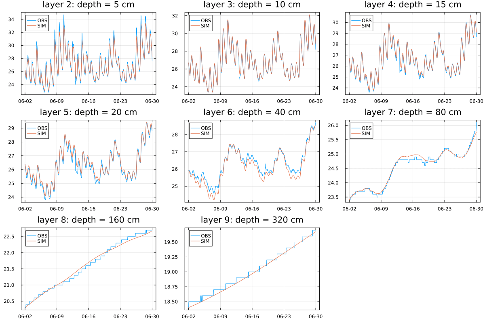

# Soil Temperature

<!--  -->

> 求解土壤热通量方程

<!-- - [x] `Bonan 2021`：计算速度快，但公式复杂
- [x] `diffeq`: 公式清晰，但计算速度过慢 -->

图1. 大气系土壤温度观测，以及土壤温度模拟结果。

<!-- ## 求解方案 -->
<!-- > 注意，sink需要划分到每一层的蒸发量 -->

## References

- <https://github.com/jl-pkgs/HydroTools.jl/blob/master/src/Soil/soil_moisture.jl>

- <https://github.com/amireson/RichardsEquation/blob/master/Richards%20Equation.ipynb>

<!-- ## 测试站点

<https://mesonet.agron.iastate.edu/agclimate/hist/hourly.php> -->
